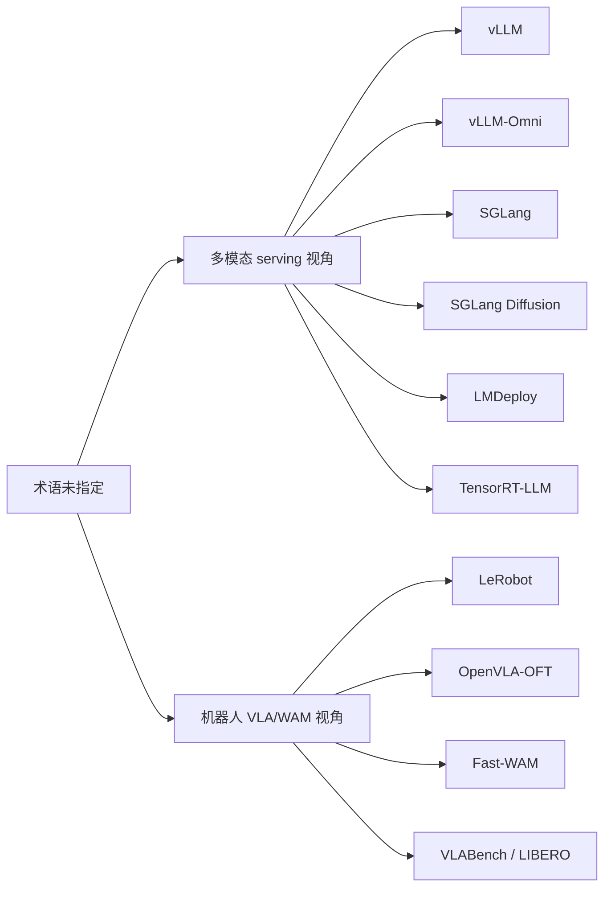
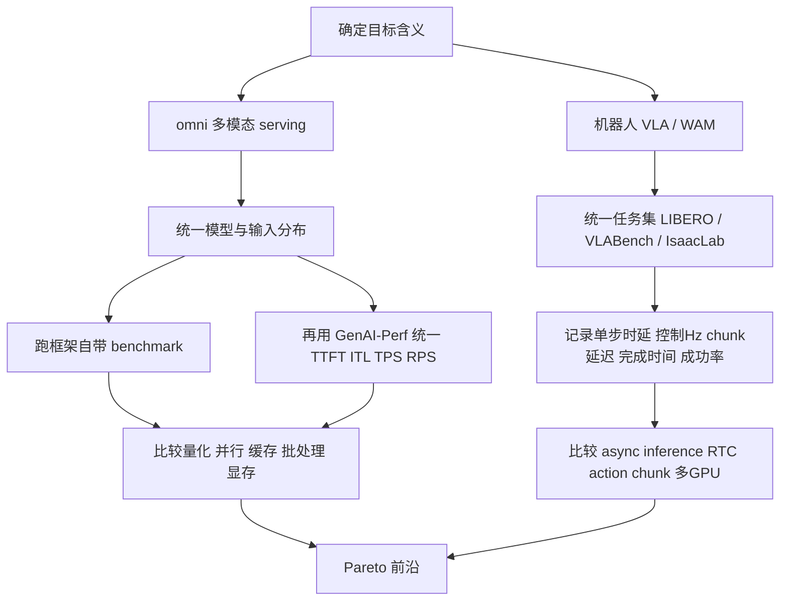

> **⚠️ UNVERIFIED CITATIONS — 2026-04-27.** This report was imported from an external
> deep-research tool that originally contained fake citation tokens (now scrubbed) that
> do NOT correspond to real sources. Specific numeric claims in this document (e.g.
> OpenVLA-OFT 4.2Hz→109.7Hz, Fast-WAM 190ms/step, vLLM 78.3k stars, JCT -91.4%)
> MUST be independently verified against primary sources before being cited in
> papers, slides, or project docs. See Task 7 of
> `docs/superpowers/plans/2026-04-27-exp08bc-rescue.md` for the scrub status.

---

# VLA 与 WAM 效率系统研究报告

## 执行摘要

这次检索里，**如果把 VLA 理解为“视觉—语言—音频 / omni 多模态工作负载”**，最值得关注的系统是 **vLLM、vLLM-Omni、SGLang、SGLang Diffusion、LMDeploy、TensorRT-LLM**。其中，**vLLM** 是当下最成熟、生态最广的通用开源 serving 引擎之一；**TensorRT-LLM** 在纯 NVIDIA 场景下最偏“工程极致性能”；**vLLM-Omni** 是公开资料里最明确面向 **text / image / video / audio 任意到任意** 管线的系统；**SGLang / SGLang Diffusion** 则在高性能 serving 与扩散生成侧都非常激进，且自带基准与 profiling 文档。

**如果把 VLA / WAM 理解为机器人领域的 Vision-Language-Action 与 World Action Models**，公开生态明显更偏研究而非 production serving：**LeRobot** 是最完整的开源训练、数据、评测与部署工作流框架；**OpenVLA-OFT** 是最强的“高效 VLA 微调 recipe / 研究代码”之一；**Fast-WAM** 是当前最清晰的、显式以 **降低 WAM 测试时延迟** 为目标的公开研究实现。与 vLLM / TensorRT-LLM 这种 serving 引擎不同，它们更像**机器人策略研究栈**，而不是通用推理基础设施。

对你点名的四个系统，可以先给出直接结论：**vLLM 有非常强的效率与 benchmark 能力，但并不直接提供机器人 VLA/WAM 训练评测栈；omni 如果指 vLLM-Omni，则是“任意多模态 serving”里最对题的候选；sglangdiffusion 明确面向图像/视频扩散生成效率，不是机器人控制框架；LeRobot 则强在数据、评测、异步推理与动作 chunk 执行，而不是通用 KV-cache 型 serving 优化**。

面向**生产评估**，我的建议很明确：  
其一，**纯 NVIDIA、追求极限吞吐/低延迟与可观测性**，优先评估 **TensorRT-LLM + GenAI-Perf**；  
其二，**希望开源、跨硬件、生态广、迭代快**，优先评估 **vLLM**；  
其三，**需要 any-to-any 音频/图像/视频/文本多阶段管线**，优先评估 **vLLM-Omni**，并与 **SGLang Diffusion** 做扩散工作负载对照；  
其四，**机器人 VLA/WAM 研究**，优先用 **LeRobot + OpenVLA-OFT / Fast-WAM + LIBERO / VLABench**。

## 术语边界与研究方法

你的问题里，**VLA 与 WAM 都是未明确缩写**。因此，本文采用双轨解释：一条是**多模态系统栈**，把 VLA 视作“Visual-Language-Audio / omni”类工作负载；另一条是**机器人系统栈**，把 VLA 视作“Vision-Language-Action”，把 WAM 视作“World Action Models”。这并不是说两者完全等价，而是为了避免把一个缩写只解释成单一方向，从而漏掉与你已知系统列表相邻的重要候选。这个处理方式也与当前公开资源的现实分布一致：一边是 serving 框架，另一边是机器人训练/评测代码。

本文优先使用**官方文档、官方 GitHub、原始论文、官方 benchmark 页面**；在可用时，优先采用**中文官方文档**，例如 SGLang 中文文档与 LMDeploy 中文文档。社区博客和二次解读只用于辅助判断，不作为核心结论依据。GitHub stars、release 频率与“被多少仓库使用”仅被当作**粗粒度社区采用代理指标**，不能等同于生产稳定性。

我采用的比较维度包括：**效率优化手段**（量化、并行、批处理、缓存、offload、prefix reuse、异步执行等）、**支持的模型类型**、**硬件目标**、**公开 benchmark 指标**（TTFT、ITL、throughput、latency、memory、control Hz、success rate 等）、**配置与基准复现实用性**、以及**工程成熟度**。其中，endpoint 级指标参考 GenAI-Perf 的 TTFT / ITL / TPS / RPS 体系，serving 框架则优先看其自带 benchmark CLI；机器人框架则优先看 LIBERO / VLABench / RoboTwin / IsaacLab 等环境中的成功率与控制频率。

## 多模态服务与推理系统

先说总体判断：如果你的目标是**“把大多模态模型稳定、可观测地跑起来，并做 latency / throughput / memory 的系统级评估”**，这类系统里最值得重点评测的是 **vLLM、vLLM-Omni、SGLang、SGLang Diffusion、LMDeploy、TensorRT-LLM**。它们都明确在官方文档中把自己定位为**高性能推理 / serving / benchmark 基础设施**，只是各自的侧重点不同。vLLM 和 SGLang 更偏**通用开源 serving 平台**，LMDeploy 更偏**中文与 VLM 部署生态**，TensorRT-LLM 更偏**NVIDIA 工程化极致性能**，而 vLLM-Omni 与 SGLang Diffusion 则最贴近你问题里可能的“Visual-Language-Audio / 视觉+音视频生成”。

| 系统 | 简述与主语言 | 官方资源 | 支持模型类型 | 关键效率特性 | 硬件目标 | 公开 benchmark 与指标 | 配置示例 | 成熟度与采用 |
|---|---|---|---|---|---|---|---|---|
| **vLLM** | 通用高吞吐、低内存 serving 引擎；主语言 **Python**，核心包含 **CUDA/C++** 内核。 | Docs / GitHub / PagedAttention 论文  | Decoder-only、MoE、hybrid attention / SSM、多模态模型、embedding、reward/classification。 | **PagedAttention**、continuous batching、chunked prefill、automatic prefix caching、CUDA/HIP graphs、speculative decoding、多种量化（FP8、INT8/INT4、GPTQ/AWQ 等）、disaggregated prefill/decode/encode、TP/PP/DP/EP/CP。 | NVIDIA、AMD、CPU，并通过插件扩展到 TPU、Gaudi、Ascend、Apple Silicon 等。 | 原始论文与官方博客给出：**内存浪费低于 4%**，吞吐相对 HF **最高 24x**、相对 TGI **最高 3.5x**；后续官方性能更新又报告 **1.8–2.7x 吞吐提升** 与 **最高 5x 延迟下降**。内置 `vllm bench` 可测 latency、online/offline throughput。 | `vllm serve <model> --tensor-parallel-size 4 --quantization fp8`；`vllm bench serve ...`。FP8 在线动态量化是官方支持路径。 | **78.3k stars**、**90** 个 release、最新 release 为 **2026-04-18**，社区极大。 |
| **vLLM-Omni** | vLLM 的 omni 扩展；主语言 **Python**。如果你说的 “omni” 指公开项目，最可能就是它。 | Docs / GitHub / 论文 / 官方博客  | **text / image / video / audio**，既覆盖 AR LLM，也扩到 **Diffusion Transformer** 与其他非自回归结构。 | **stage abstraction**、**fully disaggregated serving**、OmniConnector、dynamic resource allocation、per-stage batching、pipelined stage execution、统一量化框架、TP/PP/DP/EP、OpenAI 兼容 API、流式输出。 | GPU 为主，并扩展到 ROCm / NPU / XPU / MUSA 等平台。 | 原始论文给出 **JCT 最多降低 91.4%**；官方 benchmark CLI 可直接测试 multimodal 请求，但目前还没有像 GenAI-Perf 那样统一公开的 TTFT/ITL 看板。 | `vllm serve Qwen/Qwen3-Omni-30B-A3B-Instruct --omni --port 8091`；多 stage 模式可用 `--stage-id`、`--headless`、`--deploy-config`。 | **4.5k stars**；README 标明 **2026-02** 有首个 stable release，**2026-03** 已到 **0.18.0**，很新但迭代极快。 |
| **SGLang** | 高性能 LLM / 多模态 serving 框架；主语言 **Python**。 | 中文 docs / GitHub / 官方 benchmark 说明  | LLM、VLM、embedding、reward、rerank、diffusion language models，且兼容大量 HF 模型。 | **RadixAttention** 前缀缓存、zero-overhead CPU scheduler、PD disaggregation、speculative decoding、continuous batching、paged attention、chunked prefill、量化（FP4/FP8/INT4/AWQ/GPTQ）、quantized KV cache、HiCache、multi-LoRA batching、TP/PP/EP/DP。 | NVIDIA、AMD、CPU、TPU、Ascend、Jetson 等。 | README 声称 RadixAttention 带来 **最高 5x** 推理加速；官方在线 benchmark 仓库在对比设置下报告过 **median TTFT 约 3x 更低、ITL 约 10x 更低于 vLLM**。这些数据是官方自测，适合拿来复现，不宜直接当作中立结论。 | 官方文档明确建议调 `--mem-fraction-static`，并指出通常为 activation 预留 **5–8GB**；另可启用 quantized KV cache 并用 benchmark/profiling 文档复测。 | **26.5k stars**、最新 release **2026-04-09**；官方称生产中每天生成 trillions tokens、部署在 **40 万+ GPU** 上。 |
| **SGLang Diffusion** | SGLang 面向图像/视频扩散生成的高性能框架；主语言 **Python**。 | Docs / 官方博客 / benchmark 文档  | 图像、视频扩散模型；支持 native SGLang pipelines 与 diffusers backend。 | Cache-DiT、TeaCache、layerwise offload、attention backend 选择、LoRA、SP/TP/Ulysses/Ring/hybrid parallel、memory monitoring、OpenAI-compatible server。 | NVIDIA、AMD，以及 4090 / 5090 / MUSA 等平台；官方博客还特别提到 AMD 支持。 | 官方博客称相较其他方案 **最高 5x**；两个月更新里报告对初版 **最高 2.5x 更快**；Cache-DiT 文档给出 **最高 1.69x** 推理加速，且支持 serving latency / throughput benchmark。 | `SGLANG_CACHE_DIT_ENABLED=true sglang generate --model-path Qwen/Qwen-Image --prompt "..."`；进阶配置可通过 `SGLANG_CACHE_DIT_*` 环境变量调节。 | 依托 **SGLang 主仓**；扩散侧文档和博客在 2026 年仍高速更新，适合研究和前沿部署。 |
| **LMDeploy** | 面向 **LLM/VLM 压缩、部署、服务** 的工具箱；主语言 **Python**，核心引擎包含 **C++/CUDA**。 | 中文 docs / GitHub / VLM 服务文档  | LLM 与 VLM；官方模型列表覆盖大量 Qwen、InternVL、LLaVA、MiniCPM-V、Gemma3、Llama4 等。 | persistent batch、blocked KV cache、dynamic split&fuse、tensor parallel、高性能 kernel、权重量化与 KV 量化、请求分发服务、多机多卡、多模型服务、AWQ + KV cache quant + prefix caching 组合。 | NVIDIA 为主，Windows/Linux 均支持；PyTorchEngine 还扩展到 Ascend，仓库亦提供 ROCm 依赖分支。 | 官方主页与 README 报告：相对 vLLM **最高 1.8x 请求吞吐**；**4-bit 推理性能为 FP16 的 2.4x**；某些模型（如 internlm2-20b）可达 **16+ RPS**。 | `lmdeploy serve api_server liuhaotian/llava-v1.6-vicuna-7b --server-port 23333`；`--tp`、`--session-len`、`--cache-max-entry-count` 可直接调。 | **7.8k stars**、**63** 个 release、最新 **2026-04-08**；中文文档质量很高，特别适合中文/Intern 系生态。 |
| **TensorRT-LLM** | NVIDIA 官方的 LLM / Visual Gen 推理优化库；主语言 **Python + C++**。 | NVIDIA docs / GitHub / support matrix / benchmark 文档  | LLM、VLM、多模态、Visual Generation；有 multimodal feature matrix 与 visual generation 支持。 | **In-flight batching**、paged attention、chunked context、KV cache reuse、LoRA、speculative decoding、disaggregated serving、TP/PP/EP 多节点、`trtllm-bench`、Prometheus metrics。 | **NVIDIA GPU** 为绝对主场；若是 Jetson/DRIVE 边缘场景，另有 TensorRT-Edge-LLM。 | 官方 docs 给出：**H100 相对 A100 有 4.6x 性能**，并在 H100 FP8 上达到 **10,000 tok/s、100ms TTFT**；另有 **H200 上 Llama-70B 最高 6.7x A100** 等数据。GenAI-Perf 可测 TTFT / ITL / TPS / RPS，并支持多模态 synthetic/BYOD。 | `python3 quickstart_multimodal.py --model_dir Efficient-Large-Model/NVILA-8B --modality image`；benchmark 侧推荐 `trtllm-bench` 与 `genai-perf profile ...`。 | **13.5k stars**，NVIDIA 官方维护、提交活跃，非常适合 NVIDIA-only production。 |

在这组六个候选里，我会把它们分成三个层级。**第一层是通用 serving 主干**：vLLM、SGLang、TensorRT-LLM。你几乎无论做什么多模态系统 benchmark，都应该让它们进 shortlist。**第二层是特定 workload 加速器**：vLLM-Omni 与 SGLang Diffusion，它们更适合复杂多阶段 pipeline 或图像/视频扩散生成。**第三层是中文与 VLM 工程友好度很高的 LMDeploy**，它特别适合作为中国团队的工程基线，因为 VLM 部署、量化与中文文档都更顺手。

一个重要但容易忽略的结论是：**如果你真正想 benchmark “Visual-Language-Audio / omni”**，那么 **base vLLM 与 vLLM-Omni 不应混在一个 bucket 里比较**。base vLLM 的强项是“高吞吐文本/多模态 LLM serving”；而 vLLM-Omni 解决的是“多 stage、多架构、any-to-any”的执行图问题。SGLang 与 SGLang Diffusion 也有类似关系：前者是统一 serving 框架，后者是 diffusion 专项加速层。把这两个层级拆开评测，才不会得到“明明都支持多模态，却谁也不服谁”的假结论。

## 机器人 VLA 与 WAM 训练评测生态

在机器人方向，公开生态与上面的 serving 框架是两种完全不同的范式。这里的核心问题不只是 **TTFT / ITL / tok/s**，而是**动作块 latency、replan 频率、控制闭环 Hz、episode 完成时间、任务成功率**。因此，真正相关的候选应当是 **LeRobot、OpenVLA-OFT、Fast-WAM**，外加 benchmark 资源 **LIBERO、VLABench、IsaacLab Arena**。

| 系统 | 简述与主语言 | 官方资源 | 支持模型 / 任务类型 | 关键效率或评测特性 | 硬件目标 | 公开 benchmark 与指标 | 配置示例 | 成熟度与采用 |
|---|---|---|---|---|---|---|---|---|
| **LeRobot** | Hugging Face 的真实机器人 ML 框架；主语言 **Python**。 | GitHub / 官方 docs / notebooks  | Imitation Learning、RL、VLA；内置 ACT、Diffusion、Pi0Fast、Pi0.5、GR00T、SmolVLA、XVLA 等。 | 统一 `Robot` 接口；**LeRobotDataset v3** 采用 **Parquet + MP4**，支持 Hub-native streaming，减少文件系统压力、加快初始化；支持 `lerobot-eval`、异步推理、**RTC 实时分块**、多 GPU 训练、IsaacLab Arena 的 GPU 加速大规模评估。 | 真实机器人 + CPU / CUDA / MPS / XPU + IsaacLab 模拟。 | 框架本身**不主打通用 serving latency benchmark**，公开数字更多来自参考策略：SmolVLA 为 **450M**，20k step 训练约 **5 小时 / A100**；LeRobot 文档中的 X-VLA checkpoint 在 LIBERO 上给到 **93%**；GR00T 在其 LeRobot 实现里，LIBERO 平均分 **87%**。 | `lerobot-eval --policy.path=... --env.type=libero --env.task=libero_object --eval.n_episodes=10`；异步推理可用 `python -m lerobot.async_inference.policy_server --host=127.0.0.1 --port=8080`。 | **23.6k stars**、**9** 个 release、**179** 个仓库标记 used by，HF 官方维护。 |
| **OpenVLA-OFT** | 针对 OpenVLA 的高效微调 recipe 与研究代码；主语言 **Python**。 | 论文 / project page / GitHub / OpenVLA repo 更新  | 机器人 **Vision-Language-Action**；本质是高效适配范式，而不是通用 serving 引擎。 | **parallel decoding + action chunking + continuous actions + L1 regression**，可选 FiLM；支持 LoRA 微调与多输入扩展。 | 论文 benchmark 用 **A100/H100**；真实机实验在 ALOHA 上。 | LIBERO 上把 OpenVLA 的平均成功率从 **76.5% 提高到 97.1%**；在 A100 上，OpenVLA 从 **4.2 Hz / 0.240s** 提升到 OFT 的 **109.7 Hz / 0.073s**；带额外输入仍有 **71.4 Hz / 0.112s**。ALOHA 上，OpenVLA-OFT+ 为 **77.9 Hz / 0.321s**，而原始 OpenVLA 只有 **1.8 Hz / 0.543s**。论文摘要和 OpenVLA README 都把这一类收益概括为 **25–50x / 26x** 级别的推理加速。 | 论文中使用 **LoRA r=32**；在四个 LIBERO 套件上独立微调与评测。仓库提供下载 checkpoint 并“生成一个 action chunk”的 quick start。 | **研究成熟、工程未产品化**；GitHub 活动页可见约 **1.2k stars**。 |
| **Fast-WAM** | WAM 研究代码；主语言 **Python**。 | 项目页 / 论文 / 中文 README / GitHub  | **World Action Models**；代码覆盖 LIBERO / RoboTwin 训练与评测。 | 训练时保留 video co-training，测试时**去掉显示 future imagination**；单次前向直接生成动作；仓库提供 Deepspeed Zero-1 训练脚本、T5 文本 embedding 预计算、多 GPU eval manager；RoboTwin 评测还支持 `skip_get_obs_within_replan=true` 来跳过部分渲染、缩短评测时间。 | 项目页给出单卡 **RTX 5090D V2 32GB** 运行时数据；仓库建议 LIBERO 用 **8 卡**、RoboTwin 可用 **64 卡** 加速训练。 | 项目页给出 **190 ms** 单步 latency，且比 imagine-then-execute WAM **快 4x 以上**；LIBERO 平均 **97.6**，RoboTwin 2.0 平均 **91.8**。 | `bash scripts/train_zero1.sh 8 task=libero_uncond_2cam224_1e-4`；`python experiments/libero/run_libero_manager.py ... MULTIRUN.num_gpus=8`。 | **579 stars**；非常新、研究味强，适合作为 WAM latency baseline，而非 production stack。 |

如果你的目标是**surveying / benchmark**，而不是立即部署服务，那么以下资源值得单独列出来，因为它们补上了“系统不等于 benchmark”的那一半工作：

| 资源 | 定位 | 关键价值 |
|---|---|---|
| **VLABench** | 面向 VLA / VLM / embodied agent 的大规模机器人 benchmark。 | 论文与项目页给出 **100 类任务、2000+ 物体**；强调世界知识、长时程推理与语言条件操控。LeRobot 当前接入的是其中 **43** 个 task category。 |
| **LIBERO** | 经典机器人 benchmark。 | 提供 **130** 个任务与程序化生成机制，是当前 OpenVLA-OFT、GR00T、SmolVLA 等大量结果的共同参照系。 |
| **Efficient VLA Surveys** | 文献 surveying 入口。 | 2025 年至少已有两篇面向“高效 VLA”的系统综述，另有持续维护的 survey repo，可帮助你快速建立“模型架构—感知特征—动作生成—训练/推理”四层 taxonomy。 |
| **GenAI-Perf** | endpoint 级 benchmark 工具。 | 并非机器人 benchmark，但非常适合给 vLLM / TensorRT-LLM / TGI / OpenAI-compatible server 做统一的 **TTFT / ITL / TPS / RPS** 评测，还支持多模态 synthetic 与 BYOD 输入。 |

这一部分最重要的结论是：**机器人 VLA/WAM 方向目前公开可用的“效率系统”更多是策略级优化、评测框架与研究代码，而不是像 vLLM 那样的统一 serving 引擎**。因此，不应拿 LeRobot / OpenVLA-OFT / Fast-WAM 去和 vLLM / TensorRT-LLM 直接对比 tok/s；更合理的对比维度，是“同等任务成功率下的控制频率、单步时延、显存压力与复现实用性”。

## 已知系统核查

先给结论表。这里我把你提到的 **omni** 解释为 **vLLM-Omni**；如果你指的是另一个项目，这一行需要重新核对。

| 系统 | 是否有明确效率优化 | 量化 | 分片 / 并行 | 批处理 | 内存管理 | 多 GPU | latency / throughput 指标 | benchmarking / surveying 能力 | 核查结论 |
|---|---|---|---|---|---|---|---|---|---|
| **vLLM** | **有，而且非常强。** PagedAttention、continuous batching、chunked prefill、prefix caching、speculative decoding、CUDA/HIP graphs、disaggregation 都是核心卖点。 | **有。** FP8、MXFP8/MXFP4、NVFP4、INT8、INT4、GPTQ/AWQ、GGUF 等。 | **有。** TP / PP / DP / EP / context parallelism。 | **有。** continuous batching。 | **很强。** KV cache 管理、APC、PagedAttention。 | **有。** 单机和多机都支持。 | **有。** 论文/博客报告最高 24x vs HF、3.5x vs TGI；自带 `vllm bench`。 | **有 benchmark**，但**没有机器人 VLA/WAM survey / eval 栈**。更适合多模态 serving，而不是机器人策略研究。 | **确认具备**效率、量化、并行、batching、memory、benchmark；**不直接是机器人 VLA/WAM 框架**。 |
| **omni 也就是 vLLM-Omni** | **有。** 面向 any-to-any multimodal pipeline 的 stage-overlap 与 fully disaggregated serving 是它的核心。 | **有。** 官方 docs 明确提供 unified quantization framework。 | **有。** TP / PP / DP / EP。 | **有。** per-stage batching。 | **有。** 动态资源分配、跨 stage 数据路由、面向 diffusion 与多 stage 的内存优化。 | **有。** stage worker 模式天然支持多 GPU。 | **有。** 论文报告 JCT 最高下降 91.4%，并有 benchmark CLI。 | **有 serving benchmark**，但**没有机器人任务 benchmark**。它更像多模态系统层基础设施。 | **确认非常对题**，尤其适合你若把 VLA 理解为 Visual-Language-Audio / omni。 |
| **sglangdiffusion** | **有。** cache、offload、kernel、parallel、profiling 都很完整。 | **部分有，且仍在演进。** SGLang 主框架量化很成熟；但 diffusion 专项博客把一些 diffusion quantization 列在 roadmap 中，说明它不如 text/VLM 路线那样成熟。 | **有。** SP / TP / Ulysses / Ring / hybrid。 | **有。** 文档提供在线 serving throughput / latency benchmark。 | **有。** layerwise offload、VAE 并行、memory monitoring。 | **有。** 官方明确支持多 GPU 并行与混合并行。 | **有。** 官方博客称最多 5x，当前版本比初版最多 2.5x 快；Cache-DiT 最高 1.69x。 | **有 diffusion benchmark / profiling**，但**不提供机器人式 VLA/WAM task benchmark**。 | **确认具备强效率与 benchmark 能力**；但它是**图像/视频 diffusion 生成框架**，不是机器人控制框架。 |
| **LeRobot** | **有，但性质不同。** 它的“效率”主要是数据格式、异步推理、RTC、统一评测、多 GPU 训练和大规模模拟，不是 KV-cache 型 serving 优化。 | **框架层没有统一的通用量化卖点**；量化更取决于具体策略与底层模型实现。 | **有。** 多 GPU 训练通过 Accelerate。 | **有。** action chunk、async inference、RTC。 | **有。** LeRobotDataset v3 面向海量机器人数据的存储、流式读取与初始化压力优化。 | **有。** 训练、模拟评测、多环境都支持。 | **有一些策略级公开结果**，例如 SmolVLA 的训练时间、GR00T/X-VLA 的 LIBERO 结果；但**缺乏统一 TTFT / TPS 风格的服务侧指标**。 | **极强。** 内置 `lerobot-eval`、LIBERO、MetaWorld、VLABench、IsaacLab Arena。 | **确认非常适合 benchmarking / surveying / 研究落地**；但**不是通用 serving 引擎**。 |

如果只看你点名的四个系统，那么答案其实可以压缩成一句话：**vLLM 与 “omni=vLLM-Omni” 解决的是多模态 serving 侧效率；sglangdiffusion 解决的是扩散生成侧效率；LeRobot 解决的是机器人数据、训练、评测与在线执行工作流效率。**它们都“有用”，但它们处在**不同层次**：base serving、multi-stage omni serving、diffusion acceleration、robotics workflow。把它们平放在一个篮子里选型，容易把问题问偏。

为了便于快速筛选，我建议用下面这张总表做 first-pass：

| 候选 | 更偏生产 | 更偏研究 | 更贴近哪种 VLA/WAM 含义 | 我建议的优先级 |
|---|---|---|---|---|
| **TensorRT-LLM** | 很强 | 中等 | Visual-Language-Audio / VLM / Visual Gen on NVIDIA | 纯 NVIDIA 生产首测  |
| **vLLM** | 很强 | 很强 | 通用 LLM / VLM serving | 开源生产通用首测  |
| **vLLM-Omni** | 中强 | 很强 | any-to-any text/image/video/audio | omni workload 首测  |
| **SGLang** | 很强 | 很强 | 高吞吐 LLM / VLM serving | 与 vLLM 并排首测  |
| **SGLang Diffusion** | 中强 | 很强 | image/video diffusion | 扩散 workload 首测  |
| **LMDeploy** | 强 | 中强 | 中文/VLM 工程落地 | 中文团队强烈建议进 shortlist  |
| **LeRobot** | 中等 | 很强 | 机器人 VLA 工作流 | 机器人 benchmark 基座  |
| **OpenVLA-OFT** | 弱 | 很强 | 高效 VLA 适配 | 机器人 VLA 效率研究必测  |
| **Fast-WAM** | 弱 | 很强 | WAM latency reduction | WAM 方向必测基线  |

## 选型建议与动手基准方案

如果你的目标是**生产部署**，我会这样选。  
在 **NVIDIA-only 且你愿意接受 engine build / vendor stack** 的前提下，**TensorRT-LLM** 是最值得优先投入的，因为它把 in-flight batching、paged attention、disaggregated serving、multimodal support、`trtllm-bench` 与 GenAI-Perf 串成了一个非常完整的性能工程闭环。

如果你的目标是**开源、跨硬件、社区大、模型覆盖广**, 则 **vLLM** 仍然是最稳的第一基线。它最大的优势不是某一个 benchmark 数字，而是：功能面已经覆盖到 prefix caching、chunked prefill、量化、LoRA、多并行、多硬件插件、benchmark CLI，并且社区规模已经大到足以让排障与复现成本显著下降。

如果你的目标是**真正的 any-to-any 多模态任务**，尤其是同时含有 **音频 / TTS / 图像 / 视频 / 文本**，我建议把 **vLLM-Omni** 放到最前面；如果你的负载更偏**扩散图像 / 视频生成**，则把 **SGLang Diffusion** 放到最前面。两者都比纯 vLLM 更“对症”，只是 vLLM-Omni 更偏异构 stage orchestration，SGLang Diffusion 更偏 diffusion 栈纵向加速。

如果你的目标是**机器人研究**，推荐组合不是单个框架，而是：**LeRobot 负责数据、训练、评测与真实机执行；OpenVLA-OFT 负责高效 VLA 微调基线；Fast-WAM 负责 WAM latency baseline；LIBERO / VLABench / IsaacLab Arena 负责统一评测场景**。这条线的价值在于，你可以同时观察**任务成功率**与**控制回路时延**，而不是只盯着 token 指标。

为了做**动手 benchmark**，我建议至少准备两套实验矩阵。  
第一套是 **endpoint / serving 矩阵**：同一模型、同一 prompt 长度分布、同一图片/音频输入分布，在 **vLLM、SGLang、LMDeploy、TensorRT-LLM、vLLM-Omni、SGLang Diffusion** 上分别测试 **TTFT、ITL、TPS、RPS、P50/P95 latency、峰值显存、GPU 利用率、batch mix 效果**。这一步最好同时用每个框架自带 benchmark 与 **GenAI-Perf** 交叉验证。

第二套是 **机器人闭环矩阵**：在 **LeRobot + LIBERO / VLABench / IsaacLab Arena** 上，对 **SmolVLA / Pi0Fast / X-VLA / OpenVLA-OFT / Fast-WAM** 记录 **单步 latency、action chunk 生成 latency、控制频率、episode 完成时间、成功率、显存占用、训练到可用性能的 wall-clock**。如果要在真实机器人上跑，再额外记录 **async inference 与 RTC** 对“停顿感”“动作过渡平滑度”的影响。

一个很实用的落地顺序是这样的：  
先用 **vLLM / SGLang / TensorRT-LLM** 做纯服务基线；  
再把 **vLLM-Omni / SGLang Diffusion** 插入包含扩散或音频生成的复杂 pipeline；  
机器人方向则用 **LeRobot** 搭统一数据与 eval 脚手架，把 **OpenVLA-OFT** 和 **Fast-WAM** 当成高效策略基线。这样做的好处是，你不会把“服务性能差”误判成“策略不好”，也不会把“策略成功率高”误判成“系统已经可生产”。

## 开放问题与局限

首先，**缩写本身就是最大的不确定性来源**。你在问题里已明确说明 **VLA 可能是 very large audio，也可能是 Visual-Language-Audio；WAM 也未指定**。因此，本文虽然做了双轨覆盖，但最终 shortlist 仍会因你真正想 benchmark 的对象而变化：如果你要做机器人，LeRobot / OpenVLA-OFT / Fast-WAM 的权重会急剧上升；如果你要做 omni 音视频 serving，则 vLLM-Omni / SGLang Diffusion 的权重更高。

其次，**“omni” 我这里默认解释为 vLLM-Omni**，因为在当前公开资料里，它是最直接、最主流、且与你列出的 vLLM / sglangdiffusion / lerobot 语境最接近的 “omni” 开源系统。如果你指的是别的 Omni 项目，相关结论需要重新核查。

再次，**公开 benchmark 很难直接横向比较**。很多数字来自不同模型、不同 prompt 长度、不同 GPU、不同 batch mix，尤其是 diffusion 与 robotics 两侧，指标体系根本不同。所以，本文更重视“系统是否提供 benchmark 工具、是否能稳定复现”而不是“谁的官网数字最大”。在真正做选型时，最可靠的方法仍然是：统一模型、统一输入分布、统一硬件、统一指标，再自己跑。

最后，**WAM 的 production-grade 公开基础设施仍然稀缺**。在本次检索到的公开资源中，最明确、最像“WAM 效率系统”的是 **Fast-WAM**，但它依旧是研究代码形态，而不是类似 vLLM / TensorRT-LLM 的通用 serving 栈。这也意味着：如果你的目标真的是 WAM 生产化，当前更现实的路线往往不是“等一个成熟的 WAM serving engine”，而是**用研究代码验证 latency / success Pareto，再把关键路径拆回通用 serving 与机器人执行框架**。